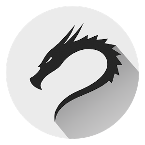
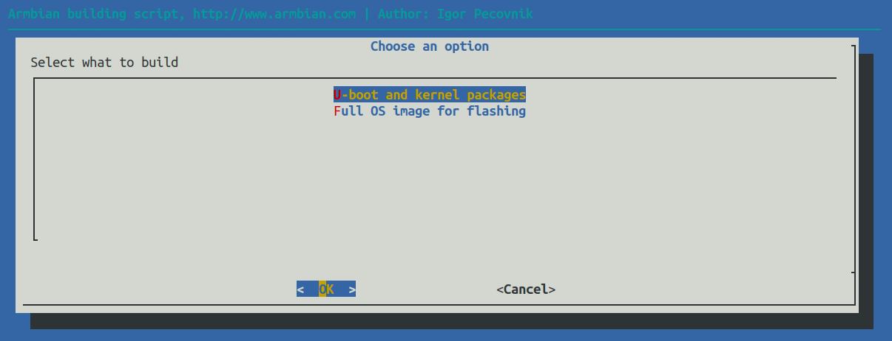

<h3 align=center><a href="https://Govanguard.com/kali"></a><br>
Kali Armbian
</h3>

<p align=right>&nbsp;</p>

## Table of contents

- [Overview](#overview)
- [What do you need to get started?](#what-do-you-need-to-get-started)
- [How to build an image or a kernel?](#how-to-build-an-image-or-a-kernel)
- [Build parameter examples](#build-parameter-examples)
- [Compare with industry standards](#compare-with-industry-standards)
- [Where to download prebuilt images?](#where-to-download-prebuilt-images)
- [Credits](#credits)

<p align=right>&nbsp;</p>

## Overview

- builds custom Debian or Kali based Linux system optimized for [supported single board computers](https://www.armbian.com/download/),
- covers root filesystem generation, kernel image compilation and bootloader compilation,
- maintains low-level control software for a [selection of hardware](https://www.armbian.com/download/),
- provides a consistent user experience by keeping system standards across different SBC platforms.

<p align=right>&nbsp;</p>

## What do you need to get started?
    
- x64 machine with at least 2GB of memory and ~35GB of disk space for the VM, container or native OS,
- Ubuntu Bionic 18.04 / Focal 20.04 x64 for native building or any [Docker](https://docs.armbian.com/Developer-Guide_Building-with-Docker/) capable x64 Linux for containerised,
- Kali 2020 x64 for native building, aria2 compiled and installed seperately
- superuser rights (configured sudo or root access).

<p align=right><a href=#table-of-contents>⇧</a></p>

## How to build an image or a kernel?

```text
apt-get -y install git
git clone https://github.com/GoVanguard/armbian
cd build
./compile.sh
```
<a href="#how-to-build-an-image-or-a-kernel"></a>

<p align=right><a href=#table-of-contents>⇧</a></p>

## Build parameter examples

Show work in progress areas in interactive mode:

```text
./compile.sh EXPERT="yes"
```

Run build tools inside Docker container:

```text
./compile.sh docker
```

Build minimal CLI Debian buster based image for Odroid XU4. Use modern kernel and write image to the SD card:

```text
./compile.sh BOARD="odroidxu4" BRANCH="current" RELEASE="buster" CARD_DEVICE="/dev/sda" \
KERNEL_ONLY="no" KERNEL_CONFIGURE="no" BUILD_DESKTOP="no" BUILD_MINIMAL="yes"
```

[Build parameters, advanced build options, user defined configuration, build with Docker?](#additional-information)

<p align=right><a href=#table-of-contents>⇧</a></p>

## Where to download prebuilt images?

- For RockPro64 and Rock64 visit https://www.govanguard.com/download/rock
- For others visit https://armbian.com/download


Armbian [releases](https://docs.armbian.com/Release_Changelog/) quarterly at the end of [February, May, August, November](https://github.com/armbian/documentation/blob/master/docs/Process_Release-Model.md). You are welcome to propose changes to our default [images build list](https://github.com/armbian/build/blob/master/config/targets.conf).


<p align=right><a href=#table-of-contents>⇧</a></p>

## Credits

Kali support developed by Shane Scott, GoVanguard.
Credit to Armbian and all of their contributors for the base system.
